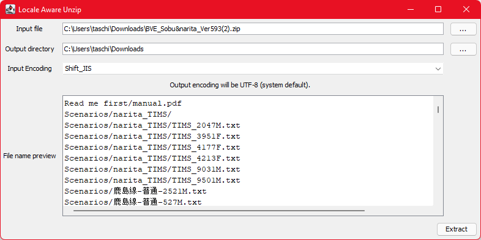
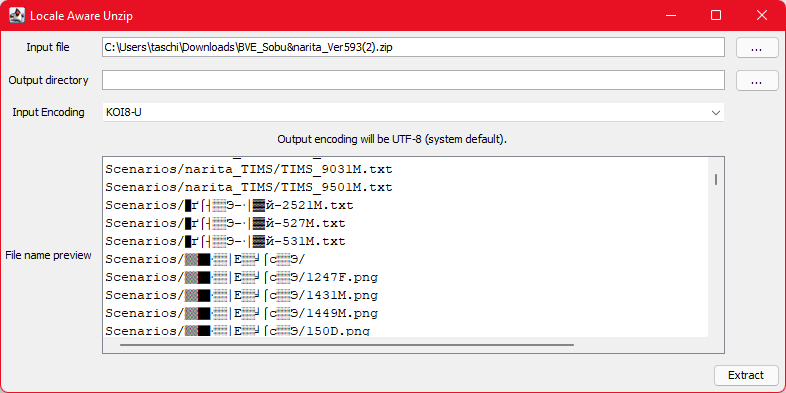

# Download

You can find the latest download here: https://github.com/Taschi120/locale-aware-unzip/releases

# About

This program allows you to extract ZIP archives which have been created on computers with a different system locale
than the one on your machine (e. g. if the archive was created on a Japanese Windows installation, and your Windows
installation is set to English). If any file within the archive has a file name which includes non-ASCII characters
(like kanji, hangul, umlauts, or emoji), these file names may get wrangled if you extract it using Windows Explorer, 
7zip or a variety of other tools.

Personally, I have encountered this issue with many add-ons for BVE, a Japanese train simulator. With this tool, you can
easily select the troublesome ZIP archive, select an output folder, select the appropriate encoding (e. g. Shift_JIS 
for archives created on Japanese machines), and hit "Extract". There's a file name preview, which allows you to check
if you have indeed selected the correct encoding - if you see weird artifact letters, like in the below screenshot, your
selected encoding is likely wrong.

There are no unit tests so far because I mostly built this in one evening, and don't expect to do a lot more development
on it in future.

A Java Runtime Environment, version 8 or higher, is required. I recommend using Temurin, available at 
https://adoptium.net/. Oracle's official JRE should also work.

The project is licensed under GPL v3. Please contact me at dev (at) hit-to-key.net in case of bugs, questions or 
feedback. You're also welcome to file an issue here on Github.
